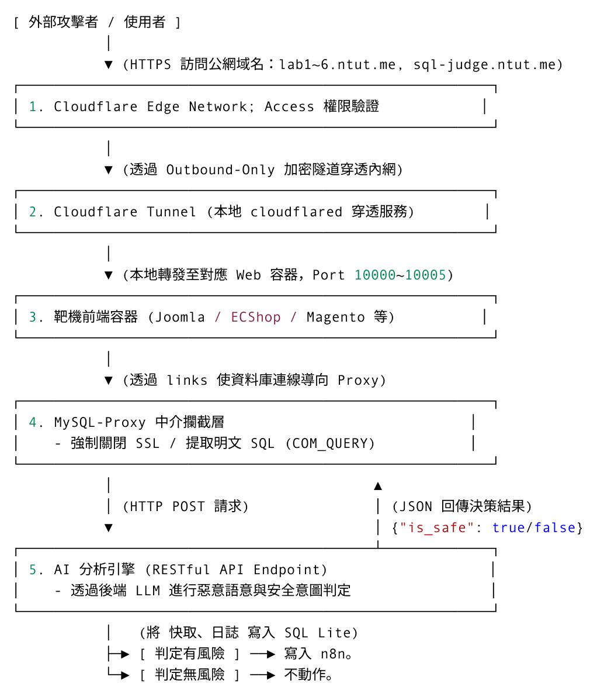

# LLM-Based SQL Injection IDS

POC: 基於 LLM 的免改代碼 SQL Injection IDS

<a href="./assets/report.pdf" target="_blank">專案報告</a>

## 簡介

目前市面上的軟體 WAF, IDS, IPS 雖然宣稱有防堵 SQL Injection 的功能，然其防堵的方法多是解析 http 封包的內容。
我們提出一種直接在網頁服務在連線到 SQL 的那段路上放的軟體防火牆。
這種設計的特點就是不用改 Code，既然屎山代碼改不動，那就繞過去吧。

## 特色

### 實現零代碼修改

透過 MySQL Proxy 機制，成功在不改動 Web Application 中的代碼的前提下，於連線通路上側錄流量，順利抓取到所有底層原生 SQL Query 進行稽核。

### 效能不受影響:

#### MySQL Proxy
將所有要送至 SQL Query Judge API 的任務獨立推送到另一個 Thread，並且將 Timeout 設定在 10 秒，避免超時請求導致阻塞。
經測試，加入 MySQL Proxy 後，平均每次查詢皆能在 20ms 以內。

#### SQL Query Judge API

透過 non-blocking 的設計，確保 API 服務能夠及時回應請求，不會因為等待 LLM 推理而延遲而導致 IO 阻塞、崩潰或卡頓。

## 專案架構

主要可以分為三坨，也方便我們接下來的名詞講解:
(Cloudflare Network, Web Application Service, SQL Query Judge)

1. Cloudflare Network(1, 2), 用做從公網訪問的接入點
2. Web Application Service(3, 4)<br>MySQL Proxy(相關文件在本專案 `/web-service` 目錄下)
3. SQL Query Judge(5)<br>接收來自 3, 4 的 SQL Query, 用 AI 判定是否有 SQL Injection 的可能，<br>若有，則發送至 n8n做風險紀錄。

1 與 2 可以不使用，只是 endpoint 通通換成本地的 localhost 即可(注意 port 號)。




## 專案執行方式

> [!CAUTION]<br>
> - 專案報告裡面看到的 endpoint domain 都是 `*.ntut.me` 這個部分需要你自行換成你自己註冊、設定的域，如果是本地運行，就 localhost，只是注意別忘了加 port 號。
> - SQL Query Judge 那端的 LLM 是靠 Ollama 起一個本地的 gpt-oss:20b 在 port 11434 上使用。

### Web Application Service

自己去點開 web-service 目錄來看，底下有個 README.md

### SQL Query Judge API

執行目錄: 本專案根目錄<br>
建議另外起一個 python venv 執行下列命令

```bash!
pip install -r requirements.txt
```

```bash!
uvicorn main:app --reload
```

#### n8n (附屬於 SQL Query Judge API 的擴充功能)

// TODO


## SQL Query Judge API Doc

### 用途

將網頁服務產生的 SQL 語令傳送給 AI 分析的介面。

* API 文件頁面 (Endpoint)：https://sql-judge.ntut.me/docs
* 請求方式 (Method)：POST
* 傳送資料格式 (JSON Body)

<div class="break-after"></div>

### 送 SQL Query 分析

Request Body

`/api/v1/analyze`
```json!
{
  "sql_query": "..."
}
```


| 欄位名稱<div style="width: 80px;"></div> | 型態<div style="width: 45px;"></div> | 必填<div style="width: 35px;"></div> | 限制 | 說明 |
| -------- | -------- | -------- |-------- | -------- |
| sql_query     | string     | 是     |最大長度 1,000,000 字元     | MySQL Proxy 攔截到的原始 SQL 語句     |


#### 回傳資料格式 (Response)

Response Example

```json!
{
  "status": "queued",
  "analysis_id": "8b689f98-00b5-47d5-993b-bcba3cf9bf70",
  "sequence_no": 5305,
  "is_safe": true,
  "result_url": "https://sql-judge.ntut.me/api/v1/results/8b689f98-00b5-47d5-993b-bcba3cf9bf70",
  "message": "SQL 查詢已接收，這是第 5305 筆背景分析任務，正在背景進行安全稽核"
}
```

| 欄位名稱<div style="width: 110px;"></div> | 型態<div style="width: 70px;"></div> | 可能值 / 範例 | 說明 |
| -------- | -------- | -------- |-------- |
| status     | string     | queued | MySQL Proxy 攔截到的原始 SQL 語句     |
| analysis_id     | string     | UUID，例如 8b689f98-00b5-47d5-993b-bcba3cf9bf70 | 該筆分析任務的唯一 ID，可用來查詢單筆結果     |
| sequence_no     | integer     | 1、5305... | SQLite 自動產生的流水號     |
| is_safe     | boolean     | true/false | IDS 非阻塞模式下先固定回傳 true 給 Proxy，代表先放行，不代表 AI 最終判斷  |
| result_url     | string     | https://sql-judge.ntut.me/api/v1/results/{analysis_id} | 查詢該筆分析結果的網址     |
| message     | string     | 說明文字 | 說明該筆 SQL 已接收並進入背景分析 |

### status_meaning

* queued:SQL 已接收，已排入背景 AI 分析佇列
* analyzing:背景 AI 分析任務正在執行
* completed:AI 已完成分析，可查看 is_safe confidence_score 與 reason
* cached:命中安全查詢快取，未重新呼叫 LLM
* error:模型分析或後端處理發生錯誤
* not_found:查詢的 analysis_id 不存在於目前記憶體結果池

